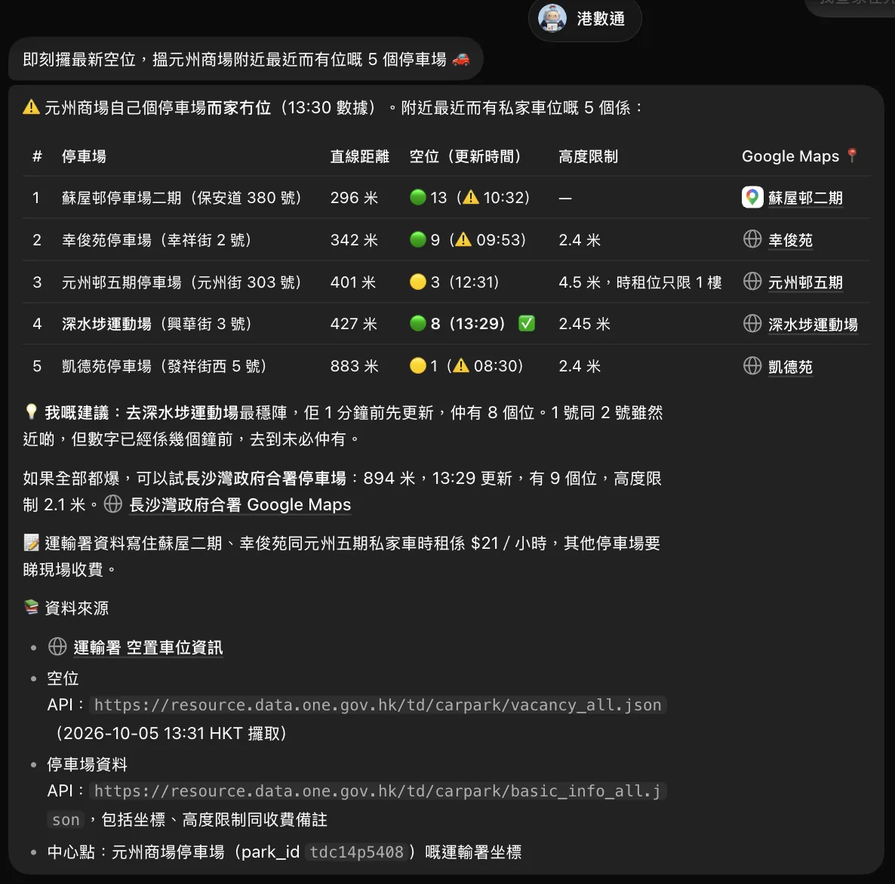
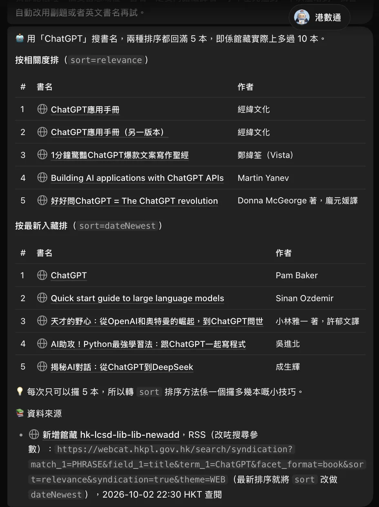
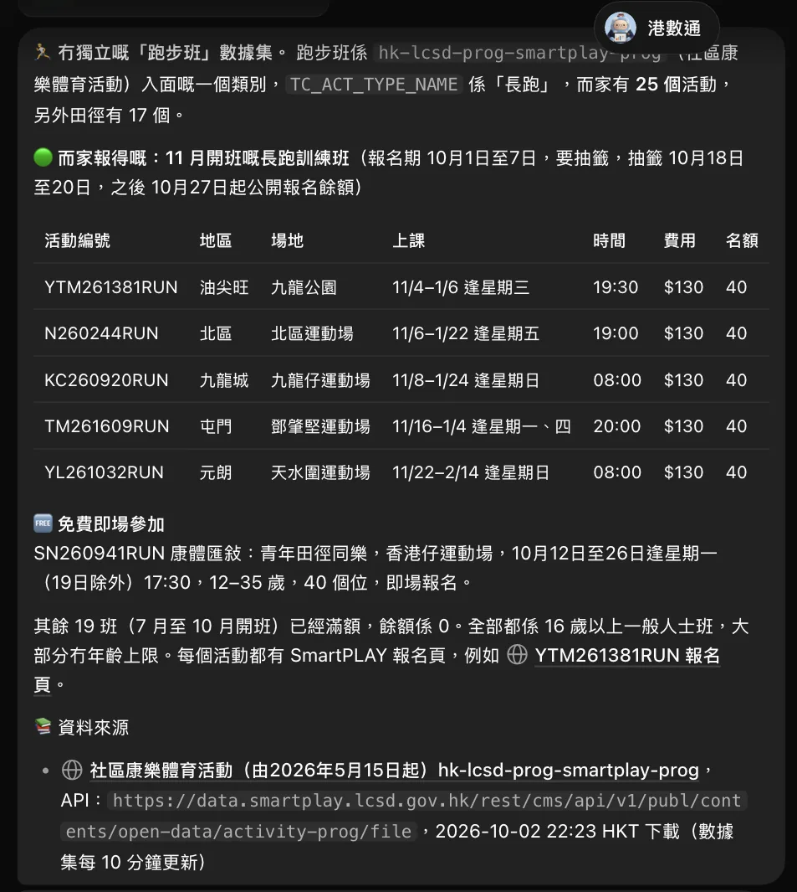
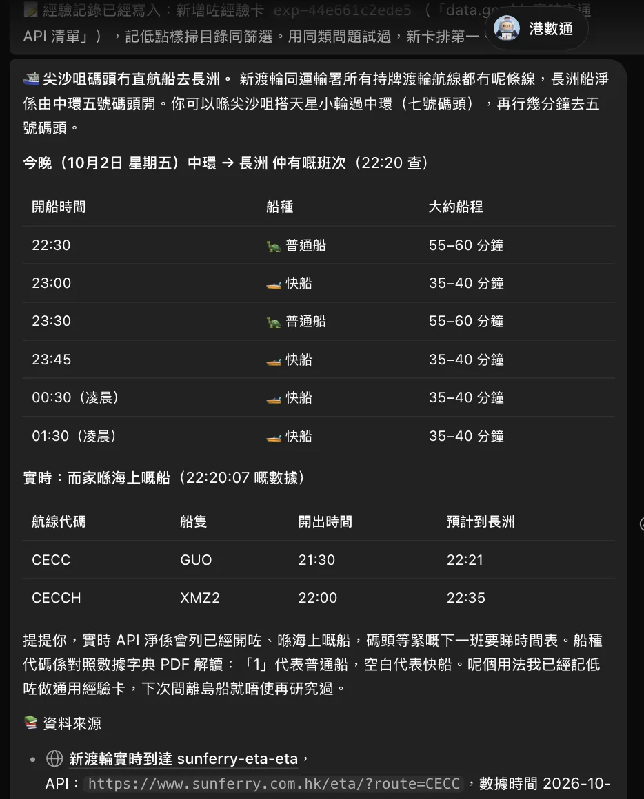
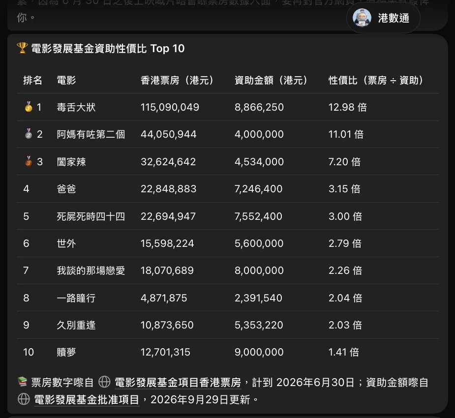
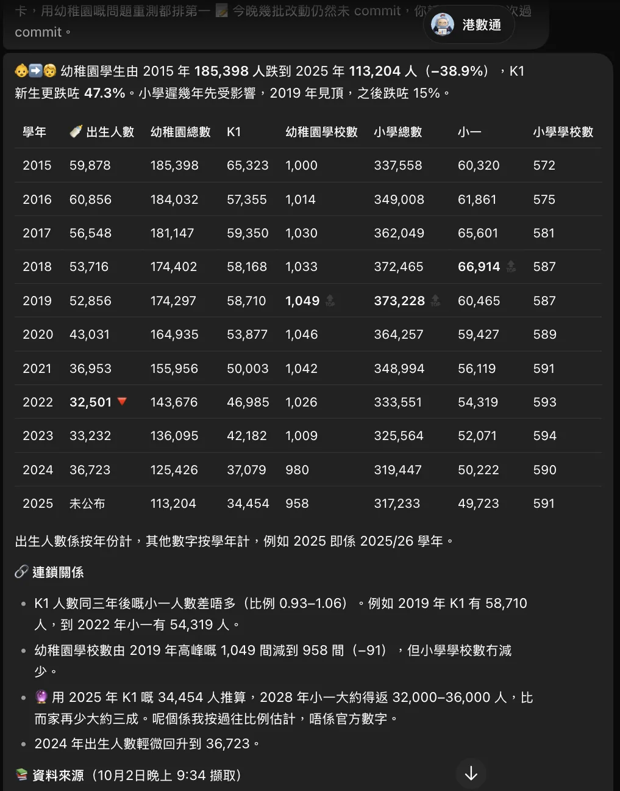

# 港數通 · hkdata

**香港政府開放數據 × AI Agent 技能** — a self-learning discovery and query
toolkit for [DATA.GOV.HK](https://data.gov.hk) open data.

> **中文版** → [README.zh-HK.md](README.zh-HK.md)

[](LICENSE)
[](https://www.python.org/)
[](https://data.gov.hk)
[](scripts/hkdata/__init__.py)

Ask it questions like *「長沙灣有冇政府健身室？」* or *"what's the air quality
right now?"* and it finds the right official dataset, queries its live API, and
answers **with an honest "no dataset exists" when that's the truth**.

```text
You    : how many PRH public housing estates are in Kwun Tong?
港數通  : 14 estates (as at 2026-06-22, HKT).
          Source: Housing Authority PSI API
          Dataset: hk-housing-eslocator-eslocator
          Endpoint: https://data.housingauthority.gov.hk/psi/rest/export/prh-estates
          Caveat: district names use "&" (Central & Western) — normalise before joining.
```

---

## In action

Real answers from the AI Agent (GrokBot) — every one cites the data.gov.hk dataset behind it.

| | | |
|---|---|---|
|  |  |  |
| **Live car-park vacancy**<br>Five nearest car parks to a mall, vacancy updated in real time | **Library new additions**<br>Search LCSD's newest books, by relevance or by date added | **Sports courses**<br>Running classes from SmartPLAY, with enrolment windows |
|  |  |  |
| **Ferry + live ETA**<br>Static timetable joined with live vessel positions | **Film-fund ROI**<br>Box office ÷ funding — two datasets joined | **Enrolment trend**<br>Kindergarten → primary series, 2015–2025 |

## What it can do

港數通 turns a natural-language question into a sourced, live answer:

- **Search the whole catalog** — all ~3,822 datasets on data.gov.hk, in English
  **and** 繁體中文, not a partial index.
- **Understand Chinese** — `康文署` resolves to `康樂及文化事務署`, so
  Cantonese / Traditional-Chinese queries just work.
- **Query the live API** — finds the right endpoint, tests it, and auto-detects
  JSON / XML / CSV to pull the current data.
- **Answer honestly** — every answer cites the dataset ID, endpoint, and the
  data's own HKT timestamp, and says "no dataset" when that's the truth.
- **Remember** — each discovery is saved as a positive/negative memory card, so
  the next similar question answers instantly.

Under the hood it crawls data.gov.hk once into a local, PII-free catalog and
searches it with hybrid retrieval (dense multilingual embeddings + keyword):

```text
catalog-sync --full --lang en,tc    crawl the whole catalog (resumable)
        │                            package_list seed → package_show per dataset
        ▼
data/catalog/*.jsonl                8 shards, 500 datasets each, PII-free
        │
catalog-embed                       embed with a local (or remote) model
        ▼
.cache/catalog/chroma/              ChromaDB stores (gitignored)
   ├── hkdata_datasets              "what datasets exist"
   └── hkdata_experiences           "how to answer this question"  (± lessons)
```

## What makes it different: it learns

Every discovery is written back as a **memory card** (positive *or* negative), so
the next similar question is answered instantly instead of re-searched:

```text
1. experience-search "gym room Cheung Sha Wan"     → no hit
2. catalog-search   "gym room"                     → hk-lcsd-facility-facility-fit
3. info + test the endpoint                         → live JSON, 87 rooms
4. experience-log   --outcome located ...          → memory written
5. experience-search "fitness room Sham Shui Po"   → answered at step 1 ✓
```

Stale cards are dated and can be superseded; the store records both *what worked*
and *what's a dead end*, so it stops repeating past failures.

| | 港數通 |
|---|---|
| **Bilingual** | English + 繁體中文 metadata (`康文署` → `康樂及文化事務署`) |
| **Hybrid search** | ChromaDB dense embeddings fused with a keyword pass + abbreviation aliases |
| **Self-learning** | every discovery logged as a positive/negative card |
| **Pluggable embeddings** | local Ollama by default; any OpenAI-compatible API (or your own backend) |
| **Honest by contract** | cites dataset ID, endpoint, and the data's own HKT timestamp |
| **Scoped** | Hong Kong government data only — everything else is redirected |

## Quick start

```bash
python3 -m venv .venv
.venv/bin/pip install -r requirements-vectors.txt
ollama pull qwen3-embedding:0.6b

bash ./hk.sh catalog-embed                 # ~10 min (shards are committed, no crawl)
bash ./hk.sh experience-embed
bash ./hk.sh catalog-search "badminton courts"
bash ./hk.sh catalog-search "康文署羽毛球場"
```

The catalog shards in `data/catalog/` are committed, so a fresh clone **only needs
to build the vector store** — no crawl. Full setup is in [SETUP.md](SETUP.md).

## Usage

```bash
# Step 1 — past experience (positive + negative)
bash ./hk.sh experience-search "gym room Cheung Sha Wan"

# Step 2 — the full catalog
bash ./hk.sh catalog-search "badminton courts"
bash ./hk.sh catalog-search "康文署羽毛球場" --top-n 5

# Inspect a dataset and test its endpoint
bash ./hk.sh info hk-lcsd-facility-facility-fit
bash ./hk.sh test "http://www.lcsd.gov.hk/datagovhk/facility/facility-fitrm.json"

# Curated verified datasets + catalog coverage + embedding backend
bash ./hk.sh search-local "enrolment"
bash ./hk.sh catalog-status
bash ./hk.sh embed-status
```

### Commands

| Command | Purpose |
|---|---|
| `experience-search "<query>"` | Relevance-ranked, paged search over past experiences (±) — Step 1 |
| `experience-log --kind positive\|negative …` | Record + index an experience (Step 5) |
| `experience-embed` / `experience-migrate` | Build / regenerate the experience index |
| `catalog-search "<query>"` | ChromaDB hybrid search over the full catalog — Step 2 |
| `catalog-sync [--full] [--refresh] [--lang en,tc]` | Seed / crawl / refresh the offline catalog |
| `catalog-embed` | Build the ChromaDB vector store |
| `catalog-status` | Coverage and vector-store report |
| `embed-status` | Active embedding backend + store match |
| `info "<id>"` | Dataset metadata (`package_show`) |
| `test "<url>"` | Test an endpoint and detect JSON / XML / CSV |
| `search-local "<query>"` | Search the curated reference docs |
| `reindex` | Rebuild `references/search-index.json` from the curated docs |
| `log-search` / `log-render` | Query / regenerate the failure & strategy logs |

All commands run through `bash ./hk.sh`, which picks the `.venv` interpreter
automatically when `chromadb` is needed and falls back to plain `python3`
otherwise — no need to choose.

### Embedding backends

Local Ollama (`qwen3-embedding:0.6b`) is the default. Switch to any
OpenAI-compatible API, or bring your own backend via the `Embedder` interface:

```bash
export HKDATA_EMBED_PROVIDER=openai
export HKDATA_EMBED_MODEL=text-embedding-3-small
export HKDATA_EMBED_URL=https://api.openai.com/v1/embeddings
export HKDATA_EMBED_API_KEY=sk-...
bash ./hk.sh catalog-embed && bash ./hk.sh experience-embed
```

See [SETUP.md](SETUP.md) *"Integrating a new backend"* for the interface.

## Layout

```
hk.sh                     single CLI entry point (picks venv or python3)
SKILL.md                  discovery workflow (the agent entrypoint)
AGENTS.md                 notes for agents using the skill
scripts/hkdata/           CLI (catalog.py, vectors.py, embeddings.py, index.py, …)
data/catalog/             sanitized catalog shards (committed)
references/               curated dataset docs + registry + aliases
logs/                     rendered views (failure log = negative, strategy registry = positive)
tests/                    pytest suite
```

## Scope

**Hong Kong government data from data.gov.hk only.** Non-HK data, non-government
sources, or general web queries are out of scope and redirected to the agent's
native web search — this keeps the store focused and the answers trustworthy.

## Data source & attribution

All dataset metadata comes from **[DATA.GOV.HK](https://data.gov.hk)** and remains
subject to its [terms and conditions](https://data.gov.hk/en/terms-and-conditions).
The committed shards in `data/catalog/` are a **sanitized projection** of
`package_show` responses: personal contact details (author/maintainer emails and
phones) are stripped, and only the fields needed for search are retained. The JSONL
store can be regenerated at any time with `catalog-sync`.

### Further reading

- [data.gov.hk Developer Guide](https://data.gov.hk/en/help/developer-guide)
- [CKAN API Documentation](https://docs.ckan.org/en/latest/api/)
- [HK Census and Statistics Department](https://www.censtatd.gov.hk/)
- [HK Observatory](https://www.hko.gov.hk/)

## Tests

```bash
.venv/bin/pip install -r requirements-vectors.txt -r requirements-dev.txt
.venv/bin/python -m pytest tests/ -q
```

## License

[MIT](LICENSE) for the code and documentation. The underlying government data is
covered by the DATA.GOV.HK terms of use, not the MIT licence.

---

_港數通 · hkdata — 香港政府開放數據，問得準，答得真。_
